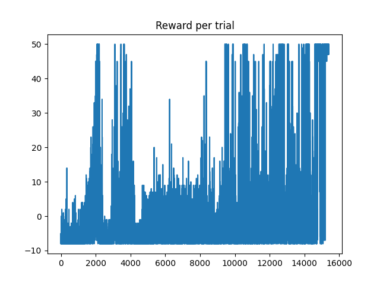
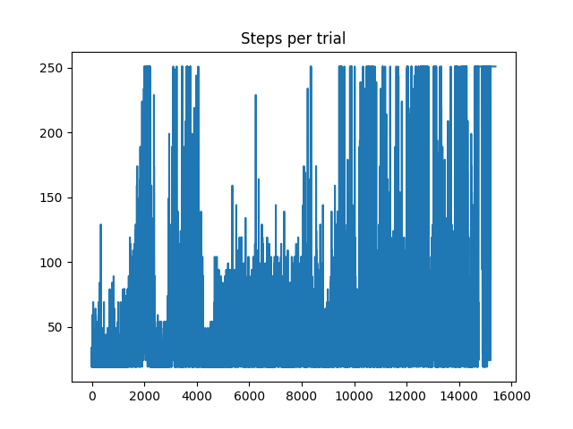

# Modified Catcher environment
Made more simple and discrete.

## Example
### Untrained example classical agent

### Trained example classical agent

## Specifications

### State space:
$s = [s_1,s_2,s_3]$ with:  
* $s_1 \in [85,255,425]=$[Left line, middle line, right lane] players $x$ centre position.
* $s_2 \in [85, 255, 425]=$[Left line, middle line, right lane]  fruits $x$ centre position
* $s_3 \in [1 , 129 , 257, 385, 481, 609]=$[Top of the screen line, intermediate position 1, intermediate position 2, intermediate position 3, bottom of the screen (catcher position), under catcher i.e. the fruit was not caught] fruits $y$ centre position   

per step (independent of agents action) the fruit goes lower in the screen by the same amount (jump to next higher $y$ coordinate). There is always one fruit present (sometimes it can't be seen since it is under the screen one step.)

### Action space:
 action_names = [left, stay (do nothing), right] coded as $[97,None, 100]$  
 * left: (if possible) jump one line to the left
 * stay: stay in the same lane
 * right: (if possible) jump one line to the right

### rewards
$r \in [1.0,0.0,-1.0,-6.0]$
* $1.0$ fruit catched
* $0.0$ no fruit catched nor lost
* $-1.0$ fruit fell through, $1$ live is lost of $3$ lifes per default
* $-6.0$ fruit fell through, no more lives. Game Over

## Task solved criterium 

The variable steps_per_episode sets the maximal reward pro episode,  as $max\_score = \frac{steps\_per\_episode}{5}$.
If the average cumulative score (reward) of the last $n$ episodes is $\geq max\_score*0.95$ the task is solved (this can and should be treated as a hyperparameter). As a first test $n=500$.

## Simplifications regarding Catcher
Discretization of $x,y$ coordinate of fruit and catcher. $3$ lanes, positions, for $x$ and $5$ for the $y$ coordinate. This $3$ and $5$ can be changed to add complexity (in the original environment these numbers would be the pixel width and height of the game window).

Velocity was dropped, to have $3$ inputs and outputs, since because of discretization it becomes constant.

No pause between fruits, normally the fruits appear at random times, although maximal one fruit is present at once.

These simplifications can be undone  step by step to add complexity.

## Reward graph example
In this case $steps_per_episode=250$ then $max\_score = 50$. And $n=500$.

